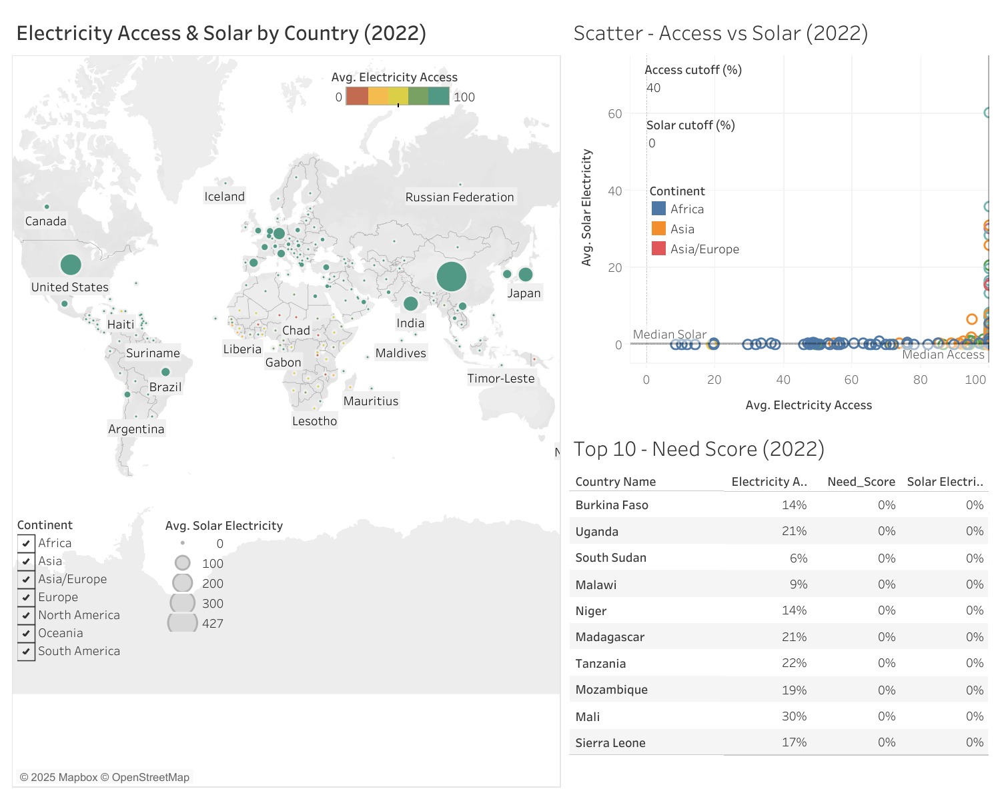
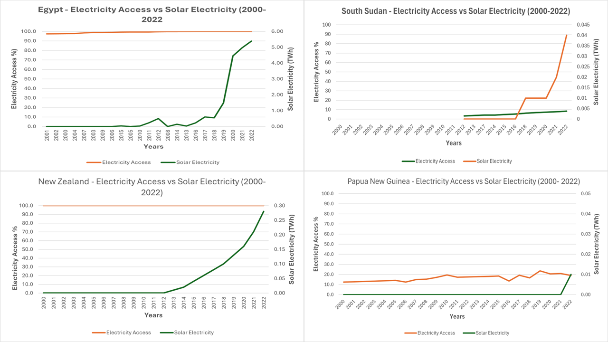
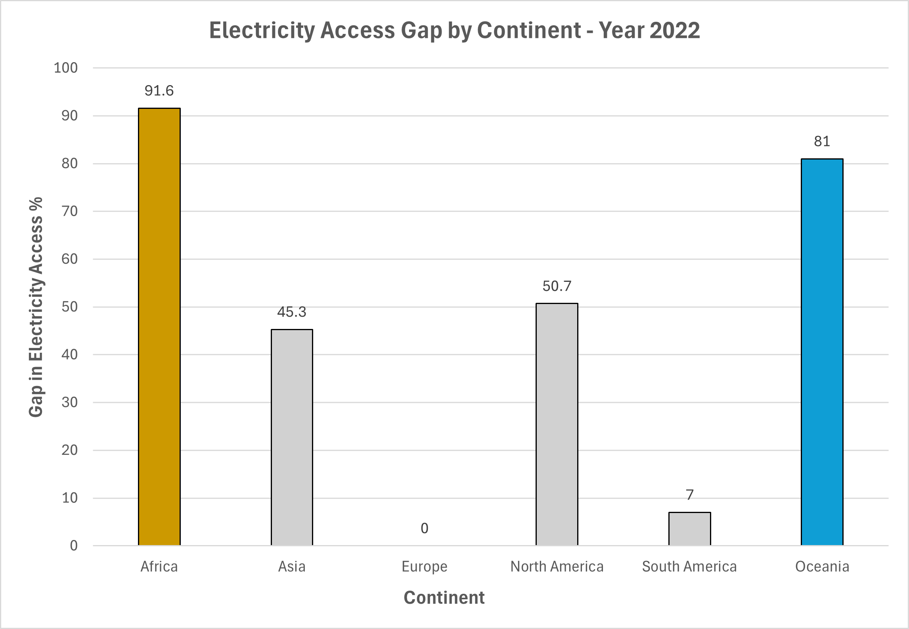
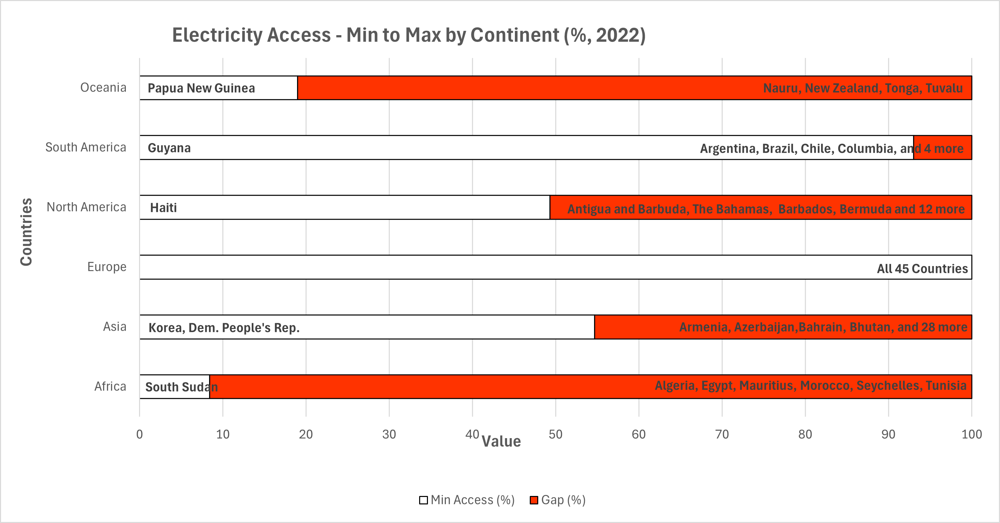

# Solar Targets — Electricity Access & Solar Potential (2025; data: 2022)

**Live dashboard:** [Tableau Public](https://public.tableau.com/app/profile/charity.mcdaniel/viz/SolarTargets2022/Dashboard)  
**Tech:** Excel, Tableau • **Scope:** Country-level • **Focus year:** 2022

---

## Project goal
**How can solar energy expand electricity access in developing countries?**  
This project explores the relationship between electricity access and solar potential to identify countries where expanding solar could most rapidly close access gaps.

---

## Overview
- **Dashboard contents**
  - **Map:** color = lower electricity access (fixed **0–100**), size = solar (%).  
  - **Scatter:** Access (x) vs. Solar (y) with **median lines**; y-axis tuned for readability.  
  - **Top-10 table:** ranks countries by **Need Score** (defined below) with adjustable cutoffs.
- **Interactivity:** Continent filter; parameter controls for access/solar thresholds.
- **Data lens:** 2022 only; countries without 2022 access are excluded; solar may be missing (shown as tiny/no size).

---

## Data sources & why
- **Electricity Access (% of population) — World Bank WDI (EG.ELC.ACCS.ZS)**  
  Directly captures the access gap by country.  
  Link: https://data.worldbank.org/indicator/EG.ELC.ACCS.ZS
- **Solar electricity (generation/capacity/share) — Our World in Data (Energy)**  
  Indicates where solar is present and scaling.  
  Citation: Hannah Ritchie, Pablo Rosado, and Max Roser (2023). *Energy*. Our World in Data. https://ourworldindata.org/energy

> These pair well: WDI shows **who lacks access**; OWID shows **where solar can scale**.

---

## Method (concise)

### Data prep (Excel / Power Query)
1) Kept overlapping years; standardized types/codes; trimmed blanks and stray spaces.  
2) Reshaped to long format and **merged** on Country Code + Year.  
3) Added **Continent** via a code→continent map (VLOOKUP).  
4) Filtered to **2022** for analysis (access required; solar optional).

### Excel analysis & visuals
- Computed each continent’s **min/max** access and **gap** (MAXIFS/MINIFS).  
- Built **Electricity Access Gap by Continent (2022)** bar chart.  
- Created four **country line charts** (e.g., Egypt, South Sudan; New Zealand, Papua New Guinea):  
  Access axis fixed at **0–100%**; Solar axis per country for visibility.  
- Built a **latest-year** bar/table showing 2022 min/max access with country labels.

### Tableau dashboard logic
- **Need Score** (used to rank Top-10):  
  \[
  \text{Need Score} = \max\big(0,\ \frac{\text{AccessCutoff} - \text{Access}}{\text{AccessCutoff}}\big)\times \text{Solar}
  \]
  - Access is on a **0–100** scale; Solar treated as **%**.  
  - Cutoffs are **parameters** (controls on the dashboard).
- **Design:** fixed scales, clear legends/tooltips, continent filter applied to all sheets.

---

## Excel visuals

*Four country trends (Access fixed 0–100%; Solar per-country scale): Egypt, South Sudan, New Zealand, Papua New Guinea.*

*Electricity Access Gap by Continent (2022).*

*2022 min/max access per continent with country labels.*

## Repository structure
