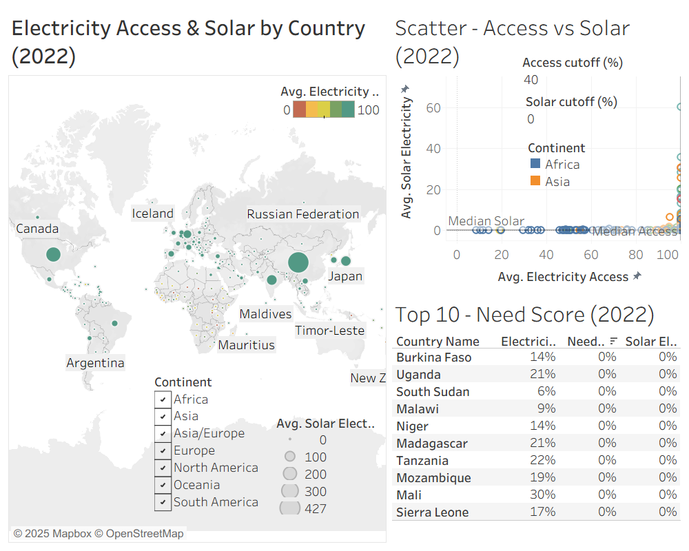

# Solar Targets — Electricity Access & Solar Potential (2025; data: 2022)

**Live dashboard:** [Tableau Public](https://public.tableau.com/app/profile/charity.mcdaniel/viz/SolarTargets2022/Dashboard)  
**Tech:** Excel, Tableau • **Scope:** Country-level • **Focus year:** 2022

**Quick links:** [Data notes](data/README.md) • [Excel workbook](excel/Solar_Energy_Project_FINAL.xlsx) • [Figures](figures/)

--- 

## Table of contents
- [Project goal](#project-goal)
- [Overview](#overview)
- [How to use](#how-to-use)
- [Data sources & why](#data-sources--why)
- [Method (concise)](#method-concise)
- [Country selection logic (why these 4)](#country-selection-logic-why-these-4)
- [Excel visuals](#excel-visuals)
- [Top-10 Need list — how it works & how to read it](#top-10-need-list--how-it-works--how-to-read-it)
- [Notes & caveats](#notes--caveats)
- [Repository structure](#repository-structure)
- [Conclusion / Decision lenses](#conclusion--decision-lenses)
- [Citations](#citations)
- [License](#license)

---

## Project goal
**How can solar energy expand electricity access in developing countries?**  
This project explores the relationship between electricity access and solar potential to identify countries where expanding solar could most rapidly close access gaps.

---

## Overview
- **Dashboard contents**
  - **Map:** color = lower electricity access (fixed **0–100**), size = solar (%).  
  - **Scatter:** Access (x) vs. Solar (y) with **median lines**; y-axis tuned for readability.  
  - **Top-10 table:** ranks countries by **Need Score** (defined below) with adjustable cutoffs.
- **Interactivity:** Continent filter; parameter controls for access/solar thresholds.
- **Focus countries:** From the 2022 gap analysis, we use Egypt & South Sudan (Africa) and New Zealand & Papua New Guinea (Oceania) to contrast high- vs low-access contexts within the two highest-gap continents.
- **Data lens:** 2022 only; countries without 2022 access are excluded; solar may be missing (shown as tiny/no size).

---

## How to use
1) Open the Live dashboard (link at top).
2) Use the **Continent** filter (right panel) to focus a region.
3) Adjust **Access cutoff (%)** and **Solar cutoff (%):** the **Top-10** re-ranks by Need Score as you move these.
4) Read the views:
   - **Map:** darker color = lower access (fixed 0–100); bigger bubble = higher solar.
   - **Scatter:** Access (x) vs Solar (y) with median lines; top-right = strong access & solar, bottom-right = high access / low solar, etc.
   - **Top-10:** highest Need Scores under current cutoffs.
5) Hover any country for a tooltip with Access, Solar, and Continent.
6) Reset anytime with **Revert (↺)** or **Undo/Redo** on the Tableau toolbar. Use **Download → Image** for a snapshot.

---

## Data sources & why
- **Electricity Access (% of population) — World Bank WDI (EG.ELC.ACCS.ZS)**  
  Directly captures the access gap by country.  
  Link: https://data.worldbank.org/indicator/EG.ELC.ACCS.ZS
- **Solar electricity (generation/capacity/share) — Our World in Data (Energy)**  
  Indicates where solar is present and scaling.  
  Citation: Hannah Ritchie, Pablo Rosado, and Max Roser (2023). *Energy*. Our World in Data. https://ourworldindata.org/energy

> These pair well: WDI shows **who lacks access**; OWID shows **where solar can scale**.

_For detailed fields, cleaning steps, and join logic, see the [Data notes](data/README.md)._

---

## Method (concise)

### Data prep (Excel / Power Query)
1) Kept overlapping years; standardized types/codes; trimmed blanks and stray spaces.  
2) Reshaped to long format and **merged** on Country Code + Year.  
3) Added **Continent** via a code→continent map (VLOOKUP).  
4) Filtered to **2022** for analysis (access required; solar optional).

### Excel analysis & visuals
- Computed each continent’s **min/max** access and **gap** (MAXIFS/MINIFS).  
- Built **Electricity Access Gap by Continent (2022)** bar chart.  
- Created four **country line charts** (e.g., Egypt, South Sudan; New Zealand, Papua New Guinea):  
  Access axis fixed at **0–100%**; Solar axis per country for visibility.  
- Built a **latest-year** bar/table showing 2022 min/max access with country labels.

### Tableau dashboard logic
- **Need Score (formula):**
  - `MAX(0, (AccessCutoff - Access) / AccessCutoff) * Solar`
  - Access is on a **0–100** scale; Solar treated as **%**.  
  - Cutoffs are **parameters** (controls on the dashboard).
- **Design:** fixed scales, clear legends/tooltips, continent filter applied to all sheets.

---

## Country selection logic (why these 4)
From the **Electricity Access Gap by Continent (2022)** bar chart, **Africa** and **Oceania** show the largest gaps in access.  
For each of those two continents, we picked:
- **One highest-access country (≈100% in 2022)** as a maturity benchmark, and
- **The lowest-access country** as a need benchmark.

This yields four case-study countries:
- **Africa:** Egypt (high access) vs **South Sudan** (low access)  
- **Oceania:** New Zealand (high access) vs **Papua New Guinea** (low access)

The 4-panel line chart compares **Access vs Solar** over time for these countries to illustrate contrasting trajectories within high-gap continents.

---

## Excel visuals

*Electricity Access Gap by Continent (2022). Africa and Oceania show the largest gaps—this motivates the focus countries.*

*For each continent in 2022: the **highest** and **lowest** access countries (with labels). Complements the gap chart.*

*Why these four: From the gap analysis, we selected one **high-access** and the **lowest-access** country in each of the two highest-gap continents—**Egypt vs South Sudan** (Africa) and **New Zealand vs Papua New Guinea** (Oceania). Access is fixed at 0–100%; Solar uses a per-country scale.*

--

## Top-10 Need list — how it works & how to read it
**What it measures.** Ranks countries by a **Need Score** that grows when electricity access is lower and solar potential is higher.

**Score (intuition).** The farther a country is below the **Access cutoff**, the more “need”; the higher its **Solar %**, the more feasible the solution.

**Built from:**
- **Access** (0–100%) and **Solar** (0–100%) using the 2022 lens
- **Parameters:** *Access cutoff (%)* and *Solar cutoff (%)* (dashboard controls)
- **Need Score:** `MAX(0, (AccessCutoff - Access) / AccessCutoff) * Solar`

**How to read it**
- High rank = **low access + high solar** under your current cutoffs.
- Change the cutoffs to fit strategy (e.g., humanitarian vs. optimization) and watch the Top-10 update.
- Use the **Continent** filter to focus regionally.

**Defaults used in this dashboard:** Access cutoff = **40%**, Solar cutoff = **0%**. Adjust these to match your goals.

*Tip:* The image below reflects the current default cutoffs used in the dashboard.

---

## Notes & caveats
- Analysis lens is **2022**; countries without 2022 electricity access are excluded.
- Some 2022 **solar** values are missing → appear as tiny/no-size bubbles on the map.
- Access & Solar are treated as **percentages (0–100)** across charts and tables.
- Solar from OWID may be reported as TWh/capacity originally; converted to a %-style indicator for comparability.
- Regional aggregates removed; **countries only**. Codes standardized; any duplicate country-year rows averaged for display.

---

## Repository structure

    .
    ├─ README.md
    ├─ LICENSE
    ├─ data/
    │  └─ README.md
    ├─ excel/
    │  └─ solar_targets.xlsx
    └─ figures/
       ├─ dashboard.png
       ├─ map_access_solar.png
       ├─ scatter_access_vs_solar.png
       ├─ top10_need.png
       ├─ excel_gap_continent_2022.png
       ├─ excel_minmax_continent_2022.png
       └─ excel_country_trends_4.png

---

## Conclusion / Decision lenses
This dashboard is designed to answer one question: **Where would added solar most accelerate electricity access?** Your answer depends on goals:

- **Humanitarian impact:** prioritize countries with **very low access** but **non-trivial solar**.  
  *Try lower Access cutoff (e.g., 30–40%) and modest Solar cutoff (≥0–5%).*
- **Optimization / ROI:** prioritize countries with **moderate-to-high access** and **strong solar** where incremental capacity is likely to scale quickly.  
  *Try higher Access cutoff (e.g., 60–80%) and a higher Solar cutoff.*

**From our 2022 analysis**, the Top-10 list under default cutoffs highlights countries where sponsors could see meaningful gains from solar deployment. If your mission emphasizes **stabilizing strong grids**, use higher access thresholds; if it emphasizes **closing the basic access gap**, use lower access thresholds.  
**The choice is yours**—the tool makes the trade-offs explicit.

## Citations
- World Bank (WDI). *Access to electricity (% of population)* (EG.ELC.ACCS.ZS). https://data.worldbank.org/indicator/EG.ELC.ACCS.ZS
- Ritchie, H., Rosado, P., & Roser, M. (2023). *Energy*. Our World in Data. https://ourworldindata.org/energy

## License
Released under the **MIT License**. See [`LICENSE`](LICENSE) for details.
